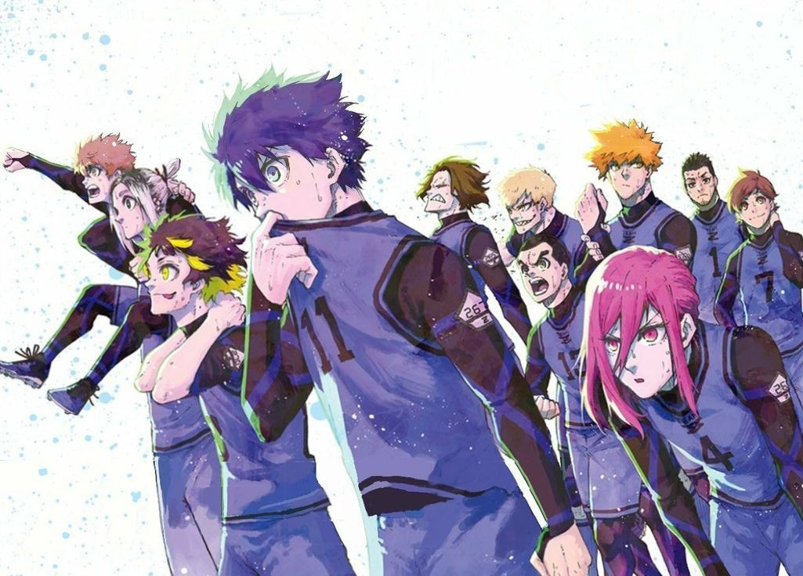
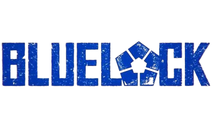

# Projeto-Animes

 

## Description

 This project features an interactive interface where anime fans can explore the origins of the protagonists of their favorite series. Through buttons on the interface, you can click and discover the story of each main character, better understanding their motivations and past. It's a fun and easy way to dive into the universe of each anime and get to know the characters you love so much. 

#

## What did i learn? 

 - Enhancing "Mobile First" skills.
 - Responsive on mobile and larger screens.
 - Making codes more optimized.
 - improving problem-solving techniques.

## technologies used

<table>
  <tr>
    <td>HTML</td>
    <td>CSS</td>
    <td>Javascript</td>
  </tr>
  <tr>
    <td>5.0</td>
    <td>3.0</td>
    <td>ECMAScript5.1</td>
  </tr>
</table>

#

## How to access

To access the website, click on the link below!  
<a href="https://filipi-pinheiro.github.io/Projeto-Animes/" target="_blank">Access to website</a>

#

 

  click on the anime logo, and watch the magic happen!

